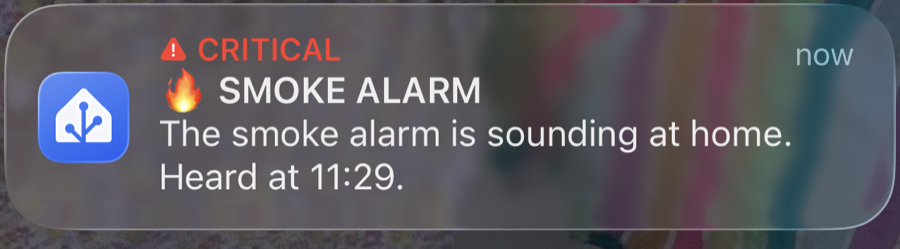
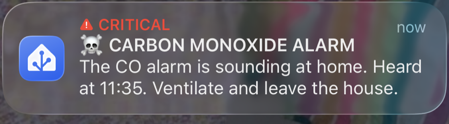
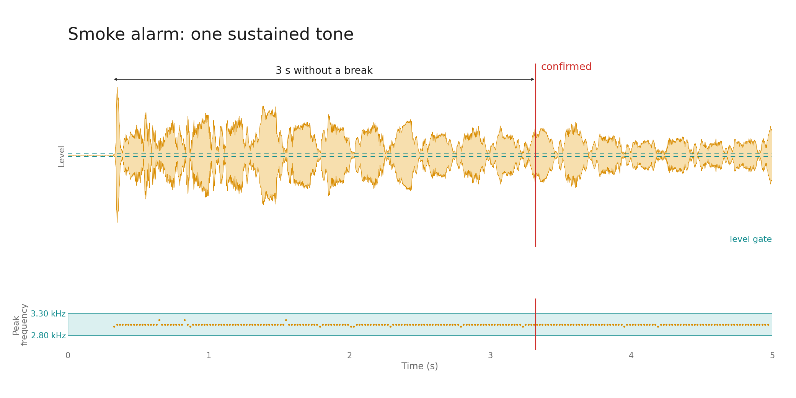
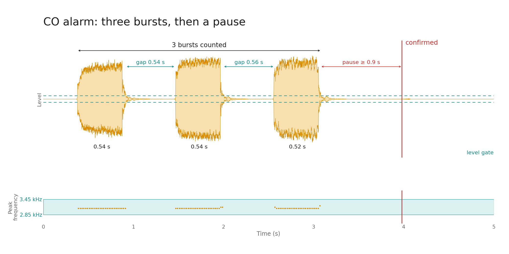

# Cardputer alarm listener for Home Assistant

A smoke alarm is very good at shouting, as long as somebody is home to hear it.
This firmware turns an [M5Stack Cardputer ADV](https://docs.m5stack.com/en/core/Cardputer-Adv)
into a small, dedicated pair of ears: it sits near the alarms, recognises the
sound of the real smoke and carbon monoxide alarms, and tells
[Home Assistant](https://www.home-assistant.io/) which one went off. Home
Assistant does the rest: a critical alert to your phone, lights, whatever
your automations do.

<p align="center">
  <br>
  
</p>

The story behind it, with the measurements, is on the blog:
[Teaching a Cardputer to Hear My Smoke Alarm](https://poolbeg.co/teaching-a-cardputer-to-hear-my-smoke-alarm/).

> **Not a life-safety device.** This is a hobby project that adds a remote
> notification path for existing certified smoke and CO alarms. It is not a
> certified detector, may miss or misidentify alarms, and must never replace,
> silence, or reduce reliance on real alarms. Provided as-is, without warranty
> of any kind; see [LICENSE](LICENSE). Use entirely at your own risk.

## How it works

The Cardputer's microphone is sampled continuously in 20 ms blocks. Each block
is scanned for a dominant tone in the alarm range, and a small state machine
in [`src/alarm_detector.cpp`](src/alarm_detector.cpp) decides whether the
sequence of tones matches one of two signatures measured from the actual
alarms with their TEST buttons.

### Built for these two alarms

| Alarm | Model | Sound |
|---|---|---|
| Smoke | [Aico Ei141-series](https://www.aico.co.uk/product/ei141rc-ionisation-smoke-alarm/) mains ionisation smoke alarm (Ei141 / Ei141RC) | One loud, harmonically rich tone that refuses to stop |
| CO | [Aico Ei208](https://www.aico.co.uk/product/ei208-battery-co-alarm/) battery carbon monoxide alarm | Three short beeps, then a pause (Aico's own spec: "3 rapid pulses followed by a ½ second pause") |

Both are common in Irish and UK homes, and the detector's constants are tuned to
these units as measured from where the Cardputer lives. A different model, a
different room, or even the same model on a different wall can sound different
enough to be missed, so treat the profiles below as a starting point and
[measure your own](#tuning-it-to-your-own-alarms).

What the detector wants from each:

| Alarm | Signature |
|---|---|
| Smoke (Ei141) | 2.8–3.3 kHz sustained for 3 s, only brief dropouts allowed |
| CO (Ei208) | Three 0.28–0.85 s bursts at 2.85–3.45 kHz, valid gaps between them, then 0.9 s of quiet |

<p align="center">
  <br>
  
</p>

Anything that fails a check (a burst too short, a gap too long, the pitch
drifting) silently resets the pattern, which is why a single chirp or a
microwave beep does nothing. Detection runs entirely on the device; Wi-Fi only
carries the result.

On a match the firmware publishes to MQTT and Home Assistant picks it up through
[MQTT discovery](https://www.home-assistant.io/integrations/mqtt/#mqtt-discovery)
as a device called **Cardputer Alarm Listener** with two
[binary sensors](https://www.home-assistant.io/integrations/binary_sensor/)
(`smoke` and `carbon_monoxide` device classes). Raw topics live under
`cardputer-alarm-<id>/#` (`<id>` is derived from the chip MAC): `smoke` and
`carbon_monoxide` are each retained `OK` or `ALARM`, `status` is `online` or
`offline`, and `telemetry` is JSON with microphone, signal, and Wi-Fi health.

## What it does when things go wrong

An appliance that waits for years needs to survive the boring failures:

- Audio detection keeps running through Wi-Fi and MQTT outages; MQTT work lives
  on the other ESP32 core so network trouble stays away from the audio loop.
- State and availability messages are retained, so Home Assistant sees the
  right thing after a broker restart.
- An alarm that could not be delivered is latched in flash and published once
  the connection returns, even across a reboot.
- An alarm clears only after Home Assistant has shown it for at least one minute
  and nothing alarm-like has been heard for 90 s.
- A task watchdog reboots a wedged main loop straight back into the listener.
- The microphone is restarted if capture stalls or returns digital silence.
- The internal battery bridges a short USB power interruption (power switch on,
  battery maintained).

## Setup

You need a Cardputer ADV, [PlatformIO](https://platformio.org/) and a Home
Assistant instance with the
[MQTT integration](https://www.home-assistant.io/integrations/mqtt/) and a
broker (the [Mosquitto add-on](https://github.com/home-assistant/addons/tree/master/mosquitto)
is the usual choice).

1. Build and flash over USB:

   ```sh
   pio run -e cardputer-adv
   pio run -e cardputer-adv -t upload --upload-port /dev/cu.usbmodem*
   ```

2. The Cardputer starts a Wi-Fi access point and shows its name and password on
   the display. Join it, open `http://192.168.4.1`, and enter your Wi-Fi details
   plus the MQTT broker host (no `http://`), port, username and password.
3. With MQTT discovery enabled, the **Cardputer Alarm Listener** device and its
   two entities appear in Home Assistant automatically.
4. Put the Cardputer in its final spot and press TEST on every smoke and CO
   alarm. Check that Home Assistant marks the *matching* entity as `Detected`
   and leaves the other one alone.

Hold the top `G0` button to reopen the setup portal later; detection keeps
running while it is open. The screen sleeps after two minutes; `G0` or any key
wakes it, and an alarm wakes it at full brightness.

For a fixed installation you can skip the portal: copy
[`include/device_config.example.h`](include/device_config.example.h) to
`include/device_config.h` and fill in the credentials. That file is git-ignored
and its values win on every boot. Without it the firmware still builds with the
placeholders and falls back to the portal.

## Where to put it

Mount it with the microphone opening unobstructed, away from speakers, TVs,
fans, extractor hoods and direct drafts. Keep the USB cable and power adapter
somewhere smoke or heat would not reach them early. When awake the display
should read `Mic: OK`, `WiFi: OK` and `HA/MQTT: OK`. Most of the time it should
look boring, which is the correct look for a device whose job is waiting.

A closed door, a flat battery, a different alarm model, a blocked microphone or
an unusual room can all stop the recognition, so test every alarm plus this
listener after installation and at least monthly.

## Tuning it to your own alarms

The two signatures are measured from an Aico Ei141 and an Ei208 in one
particular house. If your alarms are anything else (and even if they are the
same models), measure them from the Cardputer's final location:

1. Record each alarm's TEST cycle on your phone from where the Cardputer will
   live.
2. Run [`tools/analyze_alarm_audio.py`](tools/analyze_alarm_audio.py) on the
   recording (needs `ffmpeg` and `numpy`). It converts to 16 kHz mono, the
   Cardputer's mic rate, and prints one line per detected burst with duration,
   frequency and tonal purity.
3. Compare those numbers with the constants at the top of
   [`src/alarm_detector.cpp`](src/alarm_detector.cpp) and adjust the frequency
   windows, burst lengths and gaps to match.
4. Run the host tests, flash, and test with the real alarms again. Every change
   to the detector or its location earns a fresh round of TEST buttons.

The signal-processing state machine builds and tests on the host without any
embedded tooling:

```sh
xcrun clang++ -std=c++17 -Wall -Wextra -Wpedantic -Isrc \
  test/test_alarm_detector.cpp src/alarm_detector.cpp \
  -o /tmp/cardputer_detector_tests
/tmp/cardputer_detector_tests
```

[`tools/plot_alarm_signatures.py`](tools/plot_alarm_signatures.py) renders the
figures above from your own recordings.

## Watching it think

The firmware prints `BOOT`, `STATUS` (every ~2 s), `FRAME` (while audio is
above the level gate) and `DETECT tone=… bursts=… smoke_event=… co_event=…`
lines at 115200 baud. Read them with `pio device monitor`, or, if the USB port
is exposed over the network by [`ser2net`](https://github.com/cminyard/ser2net):

```sh
python3 tools/serial_capture.py <ser2net-host> 4000 serial.log
```

The `DETECT` lines show exactly which burst, gap or frequency check accepted or
rejected a cadence, which is the fastest way to work out why a test was missed.
This is what a CO TEST looks like: a stray opening chirp rejected as too short,
then three bursts at 3150 Hz accepted, then the event:

```
DETECT tone=1 bursts=0 rms=37.7 peak=3150Hz quality=0.124 smoke_event=0 co_event=0
DETECT tone=0 bursts=0 rms=21.7 peak=3150Hz quality=0.066 smoke_event=0 co_event=0
DETECT tone=1 bursts=0 rms=39.4 peak=3150Hz quality=0.132 smoke_event=0 co_event=0
DETECT tone=0 bursts=1 rms=10.2 peak=3150Hz quality=0.125 smoke_event=0 co_event=0
DETECT tone=1 bursts=1 rms=39.9 peak=3150Hz quality=0.108 smoke_event=0 co_event=0
DETECT tone=0 bursts=2 rms=7.7  peak=3150Hz quality=0.077 smoke_event=0 co_event=0
DETECT tone=1 bursts=2 rms=42.3 peak=3150Hz quality=0.111 smoke_event=0 co_event=0
DETECT tone=0 bursts=3 rms=9.5  peak=3150Hz quality=0.084 smoke_event=0 co_event=0
DETECT tone=0 bursts=0 rms=7.4  peak=4200Hz quality=0.004 smoke_event=0 co_event=1
```

## Built with

- [M5Cardputer](https://github.com/m5stack/M5Cardputer) library for the display, keyboard and microphone
- [WiFiManager](https://github.com/tzapu/WiFiManager) for the setup portal
- [PubSubClient](https://github.com/knolleary/pubsubclient) for MQTT
- [PlatformIO](https://platformio.org/) with the Arduino ESP32 core
- [Claude Code](https://claude.com/claude-code) wrote most of it; a human measured, tested and argued with it

## License

[MIT](LICENSE). Not a life-safety device; see the notice at the top.
